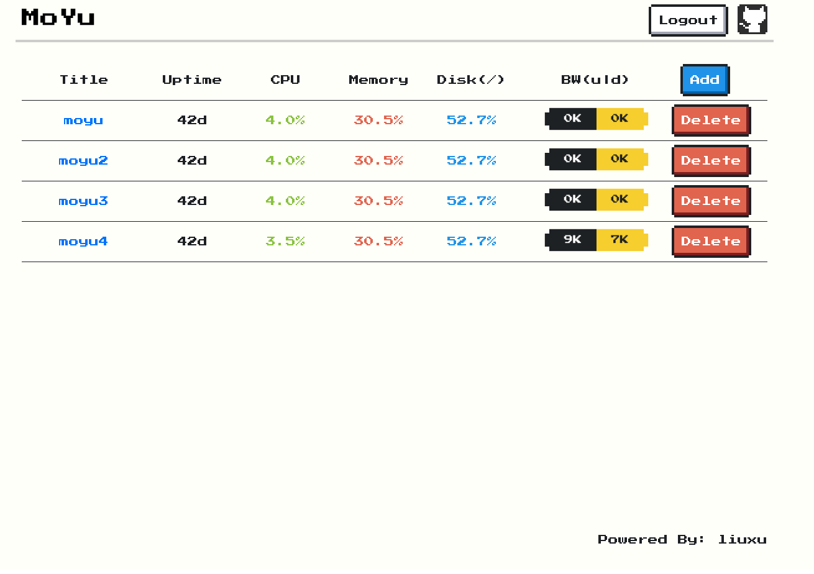
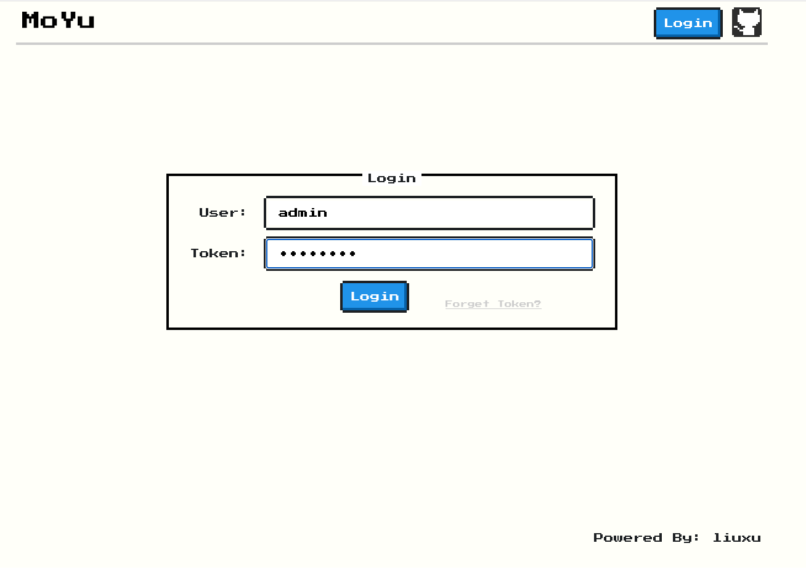
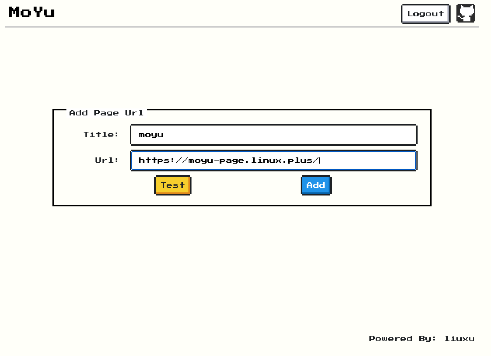

# 墨鱼探针

## 简介

墨鱼探针为主从模式，主为`墨鱼manager`，从为`墨鱼page`。`墨鱼manager`可获取展示多个墨鱼page的简要状态信息，登录后可点击title进入墨鱼page页面。`墨鱼page`独立部署，可独立使用。

技术栈：go(fiber) + vue2 + element-ui + nes.css。

最终将前端和后端全部编译到一个二进制程序中，分为`moyu-manager`和`moyu-page`2个二进制程序。

## 展示

### 墨鱼manager

未登录主页：


已登录主页：



登录页：



添加墨鱼page页面：



### 墨鱼page


## Docker运行

### 前提说明

#### 墨鱼manager

1. 墨鱼manager依赖`sqlite3`，需要使用`moyu/manager/backend/database/init.sql`创建和初始化用户表数据。
2. 请使用一下目录格式存放`moyu-manager`程序和数据库。

    ```bash
    root@liuxu:/tmp/moyu# tree
    .
    ├── bin
    │   └── moyu-manager
    └── db
        └── moyu_manager.db
    ```

#### 墨鱼page

墨鱼page直接运行docker无法获取宿主机信息，需要添加一些运行参数：

1. 由于需要获取宿主机网络接口流量，所以需要以host方式运行docker。
2. 获取磁盘分区信息需要`/proc/N/mountinfo`，所以需要将宿主机的某个进程的文件挂载到docker中，然后设置`HOST_PROC_MOUNTINFO`并运行项目。
3. 项目`PORT`变量默认`8081`，可自行指定其他端口。

### 容器运行

#### 墨鱼manager

1. 自行编译或下载我编译好的镜像，下载的版本号可以是`latest`或`release`版本号。
    ```bash
    docker build -t moyu -f ManagerDockerfile .
    docker pull liuxu/moyu-manager
    docker pull liuxu/moyu-manager:v2.0.0
    ```

#### 墨鱼page

1. 自行编译或下载我编译好的镜像，下载的版本号可以是`latest`或`release`版本号。
    ```bash
    docker build -t moyu -f PageDockerfile .
    docker pull liuxu/moyu-page
    docker pull liuxu/moyu-page:v2.0.0
    ```
2. 单磁盘挂载情况下运行，其中`--network=host`指定使用宿主机网络，`--mount`挂载`dockerd`的进程`mountinfo`文件到docker中，并设置`HOST_PROC_MOUNTINFO`为挂载的文件路径。
    ```bash
    docker run --network=host -e PORT=8081 --mount type=bind,source="/proc/$(pidof dockerd)/mountinfo",target=/root/mountinfo -e HOST_PROC_MOUNTINFO=/root/mountinfo liuxu/moyu-page
    ```
3. （可选）如果还有其他分区，如我的`/boot/efi`挂载到了独立分区，想获取到这个分区信息，需要把这个目录挂载到docker中。
    ```bash
    docker run --network=host -e PORT=8081 -v /boot/efi:/boot/efi:ro --mount type=bind,source="/proc/$(pidof dockerd)/mountinfo",target=/root/mountinfo -e HOST_PROC_MOUNTINFO=/root/mountinfo liuxu/moyu-page
    ```

## 编译使用

### 依赖：

make: ^4.0

nodejs: ^18.0

go: ^1.19.0

### 一键编译

1. 进入项目目录。

    ```bash
    cd moyu
    ```

2. 一键编译。

    ```bash
    make
    ```

3. 运行墨鱼manager和墨鱼page。

    ```bash
    PORT=8080 .manager/backend/moyu-manager
    PORT=8081 .page/backend/moyu-page
    ```

4. （可选）清理项目，删除编译的墨鱼探针二进制等文件。

    ```bash
    make clean
    ```

### 手动编译

#### 编译墨鱼manager

1. 进入项目目录。

    ```bash
    cd moyu/manager
    ```

2. 编译前端资源。

    ```bash
    cd frontend
    npm run build
    ```

3. 编译后端项目。

    ```bash
    cd ../backend
    go build -o moyu-manager --ldflags="-w -s" .
    ```

4. 运行墨鱼page。

    ```bash
    PORT=8080 ./moyu-manager
    ```

#### 编译墨鱼page

1. 进入项目目录。

    ```bash
    cd moyu/page
    ```

2. 编译前端资源。

    ```bash
    cd frontend
    npm run build
    ```

3. 编译后端项目。

    ```bash
    cd ../backend
    go build -o moyu-page --ldflags="-w -s" .
    ```

4. 运行墨鱼page。

    ```bash
    PORT=8081 ./moyu-page
    ```